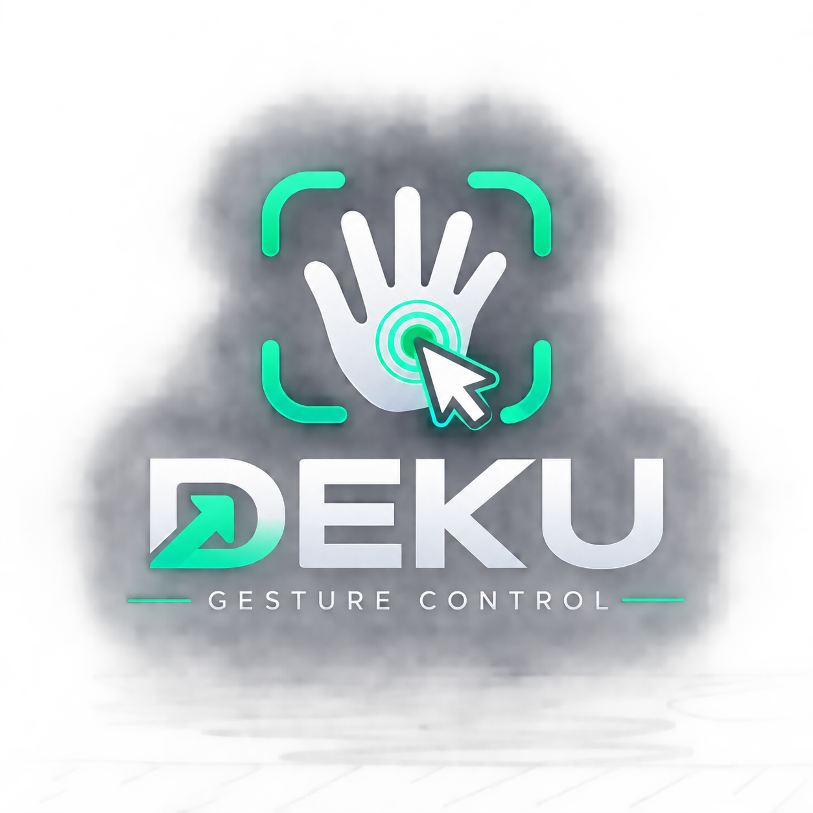
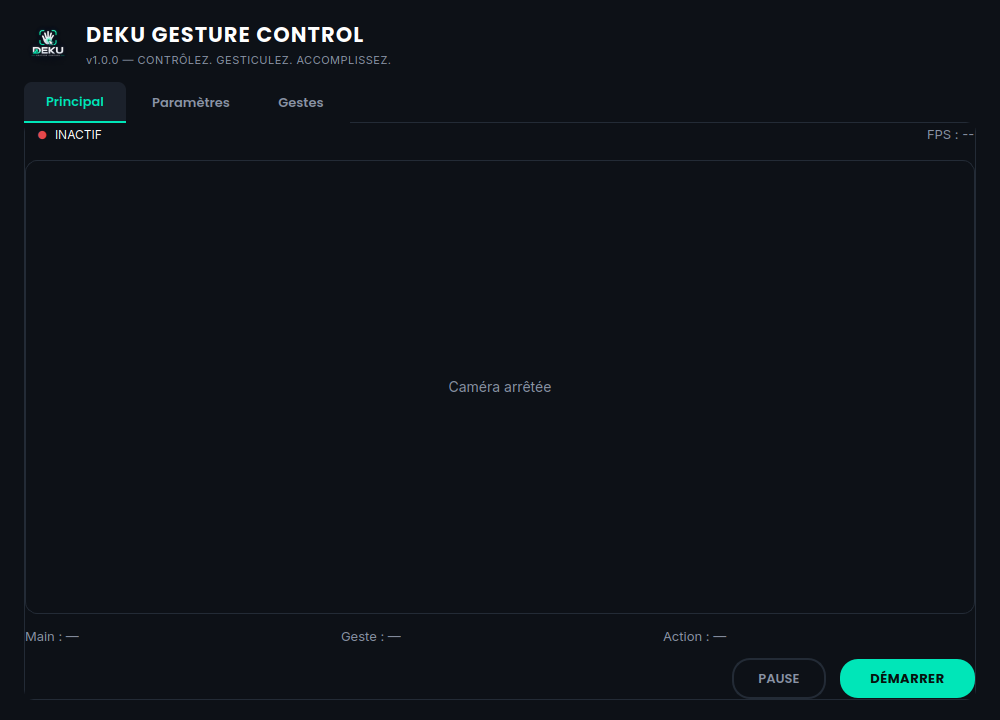
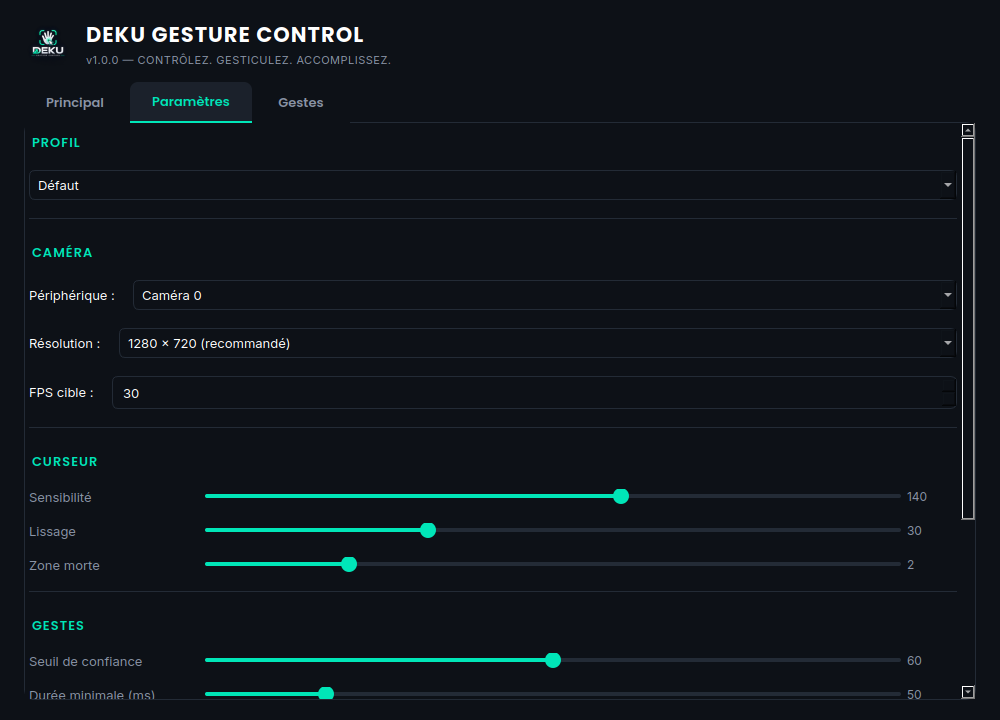
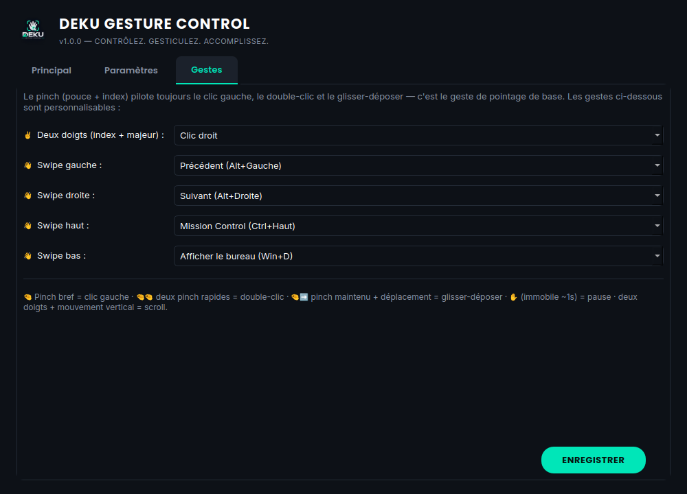
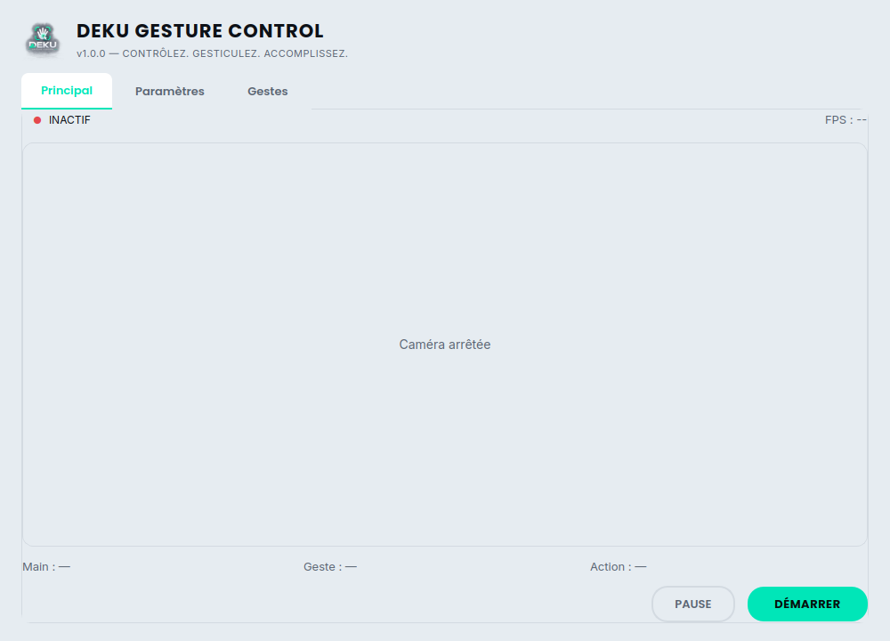

<p align="center">
  
</p>

<h1 align="center">Deku Gesture Control</h1>
<p align="center"><b>CONTRÔLEZ. GESTICULEZ. ACCOMPLISSEZ.</b></p>
<p align="center">
Contrôlez votre ordinateur Windows (souris, clavier) avec les gestes de votre main,
détectés localement par votre webcam. Aucune image n'est jamais envoyée sur Internet.
</p>

---

## Sommaire

1. [Aperçu](#aperçu)
2. [Fonctionnalités](#fonctionnalités)
3. [Installation](#installation)
4. [Premier lancement](#premier-lancement)
5. [Guide d'utilisation détaillé](#guide-dutilisation-détaillé)
   - [Déplacer le curseur](#-déplacer-le-curseur)
   - [Clic gauche](#-clic-gauche)
   - [Double-clic](#-double-clic)
   - [Glisser-déposer](#️-glisser-déposer-drag--drop)
   - [Clic droit](#️-clic-droit)
   - [Défilement (scroll)](#-défilement-scroll)
   - [Navigation (swipe)](#-navigation-swipe)
   - [Mode pause](#-mode-pause)
   - [Onglet Paramètres](#️-onglet-paramètres)
   - [Onglet Gestes](#️-onglet-gestes-mapping-personnalisable)
   - [Profils](#️-profils)
   - [Mode debug](#-mode-debug)
6. [Architecture du projet](#architecture-du-projet)
7. [Tests](#tests)
8. [Créer l'exécutable Windows (.exe)](#créer-lexécutable-windows-exe)
9. [Dépannage](#dépannage)
10. [Confidentialité](#confidentialité)
11. [État d'avancement](#état-davancement)

---

## Aperçu

| Principal | Paramètres | Gestes |
|---|---|---|
|  |  |  |

Thème clair également disponible :



---

## Fonctionnalités

- 🖐️ Détection de la main en local via webcam (MediaPipe), aucune donnée envoyée en ligne
- 👆 Déplacement du curseur piloté par l'index (calibration, sensibilité, lissage, zone morte)
- 🤏 Clic gauche, double-clic et glisser-déposer via le geste pinch
- ✌️ Clic droit via le geste deux-doigts
- 📜 Défilement (scroll) vertical via le geste deux-doigts maintenu et déplacé
- üëã Navigation par swipe (gauche/droite/haut/bas) avec raccourcis clavier configurables
- ✋ Mode pause (geste, bouton, ou raccourci clavier global) pour désactiver temporairement le contrôle
- ⚙️ Paramètres complets (caméra, curseur, gestes, interface) sauvegardés automatiquement
- 🖌️ Mapping des gestes personnalisable (clic droit, swipes) depuis l'interface
- 🗂️ Profils prêts à l'emploi (Défaut, Gaming, Présentation, Navigation web)
- 🐞 Mode debug (coordonnées, FPS, état des gestes en temps réel)
- 🌗 Thème clair / sombre
- 📦 Packaging en exécutable Windows autonome (.exe, sans installation de Python)

---

## Installation

### Prérequis

- Windows 10/11 (plateforme cible ; fonctionne aussi sur Linux/macOS pour le développement)
- Python 3.10, 3.11 ou 3.12
- Une webcam
- Une connexion Internet **au premier lancement uniquement** (téléchargement du modèle de détection de main, ~10 Mo)

### Étapes

```bash
# 1. Se placer dans le dossier du projet
cd deku-gesture-control

# 2. Créer un environnement virtuel
python -m venv venv

# 3. L'activer
venv\Scripts\activate          # Windows
source venv/bin/activate       # macOS / Linux

# 4. Installer les dépendances
pip install -r requirements.txt

# 5. Lancer l'application
python main.py
```

### Dépendances installées

| Paquet | Rôle |
|---|---|
| `opencv-python` | Capture et traitement des frames de la webcam |
| `mediapipe` | Détection de la main et de ses 21 points de repère |
| `PySide6` | Interface graphique (Qt) |
| `pyautogui` | Contrôle du curseur, des clics et du scroll |
| `pynput` | Raccourci clavier global de pause |
| `numpy` | Manipulation des tableaux d'image |

---

## Premier lancement

Au tout premier clic sur **DÉMARRER**, l'application télécharge automatiquement le
modèle de détection de main (`hand_landmarker.task`, ~10 Mo) et le met en cache dans
`assets/models/`. Une connexion Internet est nécessaire **une seule fois** ; ensuite
l'application fonctionne entièrement hors ligne.

Si le téléchargement échoue (pas de réseau), un message d'erreur clair s'affiche
avec le lien de téléchargement manuel — l'application ne plante jamais dans ce cas.

⚠️ **À savoir** : dès que la caméra est démarrée et qu'une main est détectée, le
curseur bouge réellement et les clics/raccourcis sont réellement envoyés au
système, pilotés par vos gestes. Le bouton **PAUSE** (ou le raccourci
`Ctrl+Alt+P`, actif même si la fenêtre n'a pas le focus) suspend instantanément
toute action sans fermer la caméra.

---

## Guide d'utilisation détaillé

### 👆 Déplacer le curseur

Pointez simplement votre **index** vers la webcam : le curseur suit sa position.
Une "zone active" au centre de l'image webcam est mappée sur tout l'écran, pour
ne pas avoir à approcher la main des bords physiques de la caméra.

R©glable dans **Param√®tres ‚Üí Curseur** :
- **Sensibilité** : amplifie ou réduit l'amplitude du mouvement.
- **Lissage** : réduit les tremblements (plus élevé = plus stable mais plus de latence).
- **Zone morte** : ignore les micro-mouvements involontaires.

### 🤏 Clic gauche

Rapprochez le **pouce et l'index** (pincement bref) puis rel√¢chez. Le clic est
confirmé après une courte fenêtre (~350 ms) pour vérifier qu'il ne s'agit pas du
premier temps d'un double-clic.

### 🤏🤏 Double-clic

Deux pincements rapprochés (moins de 350 ms d'écart) déclenchent un double-clic
au lieu de deux clics simples.

### 🤏➡️ Glisser-déposer (drag & drop)

Pincez et **maintenez**, puis déplacez la main : dès que le déplacement dépasse un
petit seuil, le geste devient un glisser-déposer (le bouton gauche reste enfoncé
tant que le pincement est maintenu). Relâchez le pincement pour déposer.

### ✌️ Clic droit

Tendez l'**index et le majeur** (les autres doigts repliés), brièvement, sans
bouger la main verticalement. Personnalisable dans l'onglet **Gestes** (peut être
désactivé).

### 📜 Défilement (scroll)

Comme un trackpad : tendez l'**index et le majeur**, puis déplacez la main
**verticalement** au lieu de la garder immobile. Le défilement suit le
mouvement (vers le haut = défilement vers le haut) tant que le geste est
maintenu.

### üëã Navigation (swipe)

Ouvrez la **main en grand** (5 doigts tendus) et déplacez-la rapidement dans une
direction. Quatre directions sont reconnues : gauche, droite, haut, bas. Chacune
déclenche un raccourci clavier configurable (par défaut : Précédent / Suivant /
Mission Control / Afficher le bureau). Un court temps de recharge (~0,6 s)
empêche les déclenchements en rafale.

### ‚úã Mode pause

Trois façons d'activer/désactiver la pause :
1. Bouton **PAUSE** / **REPRENDRE** dans l'onglet Principal.
2. Raccourci clavier global **Ctrl+Alt+P** (fonctionne même si une autre fenêtre a le focus).
3. **Main grande ouverte, immobile pendant ~1 seconde.**

En pause, la webcam continue de détecter la main (le geste ✋ reste actif pour
reprendre), mais **aucun clic, déplacement de curseur ou raccourci** n'est
envoyé au système.

### ⚙️ Onglet Paramètres

| Section | Réglages |
|---|---|
| **Profil** | Charge un jeu de réglages prédéfini (voir [Profils](#️-profils)) |
| **Caméra** | Périphérique, résolution, FPS cible |
| **Curseur** | Sensibilité, lissage, zone morte |
| **Gestes** | Seuil de confiance de détection, durée minimale de maintien, cooldown entre deux clics |
| **Interface** | Thème clair/sombre, mode debug |

Cliquez sur **ENREGISTRER** pour sauvegarder dans `config/settings.json`. Le
thème s'applique immédiatement ; les autres réglages s'appliquent au **prochain
DÉMARRER** de la caméra.

### 🖌️ Onglet Gestes (mapping personnalisable)

Le pinch reste toujours câblé au clic gauche / double-clic / glisser-déposer
(c'est le mécanisme de pointage de base). En revanche, vous pouvez réassigner :

- **Deux doigts** → Clic droit ou Désactivé
- **Swipe gauche / droite / haut / bas** → Précédent, Suivant, Mission Control,
  Afficher le bureau, ou Désactivé

Sauvegardé dans `config/gestures.json`.

### 🗂️ Profils

Quatre profils prêts à l'emploi, sélectionnables dans **Paramètres → Profil** :

| Profil | Effet |
|---|---|
| **Défaut** | Réglages standards |
| **Gaming** | Curseur plus sensible, moins de lissage (réactivité accrue) |
| **Présentation** | Swipe gauche/droite mappés sur Précédent/Suivant (changer de diapositive) |
| **Navigation web** | Swipe gauche/droite pour naviguer, haut/bas désactivés |

Sélectionner un profil applique et sauvegarde immédiatement ses réglages ; vous
pouvez ensuite les affiner et cliquer sur **ENREGISTRER** pour créer votre propre
variante.

### üêû Mode debug

Activé depuis **Paramètres → Interface → Mode debug**, affiche en temps réel
dans l'onglet Principal :

```
FPS: 29.8          Gesture: PINCH
Hands: 1           State: HOLDING
Confidence: 96%    Cursor: X=1120 Y=640
Index: X=742 Y=381 Action: LEFT_CLICK
Thumb: X=701 Y=397 Paused: NON
```

Utile pour ajuster les seuils de détection ou diagnostiquer un geste qui ne se
déclenche pas comme attendu.

---

## Architecture du projet

```
deku-gesture-control/
├── main.py                  # Point d'entrée
├── requirements.txt
├── requirements-dev.txt     # + pytest, pour les tests
│
├── app/                     # Bootstrap Qt (chargement des polices, etc.)
├── camera/                  # CameraManager (accès webcam)
├── vision/                  # HandTracker (MediaPipe), géométrie de la main
├── gestures/                # Machine à états, pinch/deux-doigts/scroll/swipe/pause
├── cursor/                  # Calibration, lissage, contrôle du curseur
├── input/                   # Souris, clavier, raccourci système
├── core/                    # Constantes, logger, config_manager (JSON)
├── config/                  # settings.json, gestures.json, profiles.json
├── ui/                      # Fenêtre principale, 3 onglets (Qt)
├── assets/                  # Logo, icône, polices Poppins/Inter
├── packaging/               # Fichier .spec PyInstaller + script de build
├── docs/screenshots/        # Captures d'écran utilisées dans ce README
└── tests/                   # Suite de tests pytest
```

Pipeline complet :

```
Webcam ‚Üí CameraManager ‚Üí OpenCV Frame ‚Üí HandTracker (MediaPipe)
       ‚Üí Landmark Processor ‚Üí Hand Geometry ‚Üí Gesture Engine
       → (Cursor Controller → curseur système)
       ‚Üí (Mouse/Keyboard Controller ‚Üí clics, scroll, raccourcis)
```

---

## Tests

```bash
pip install -r requirements-dev.txt
pytest tests/ -v
```

53 tests couvrent la géométrie de la main, le curseur (mapping, limites d'écran,
lissage) et les gestes (clic, double-clic, drag, scroll, swipe, pause, ainsi que
le dispatch vers les contrôleurs souris/clavier). **Aucun test ne déplace la
souris réelle** : les contrôleurs matériels sont systématiquement mockés.

> Sur Linux sans serveur graphique, `pyautogui` nécessite une variable
> `DISPLAY` valide (ex. via Xvfb) pour s'importer — non nécessaire sur Windows.

---

## Créer l'exécutable Windows (.exe)

PyInstaller doit être exécuté **sur la plateforme cible** (Windows) pour produire
un `.exe` Windows :

```bat
pip install pyinstaller
packaging\build_windows.bat
```

R©sultat : `dist\DekuGestureControl\DekuGestureControl.exe`, ex√©cutable sur
n'importe quel PC Windows **sans installer Python**. Copiez tout le dossier
`dist\DekuGestureControl` (l'exécutable a besoin des fichiers à côté de lui).

Le fichier `packaging/deku_gesture_control.spec` inclut déjà l'icône
(`assets/icon.ico`), les assets et la configuration par défaut. Ce processus a
été validé dans l'environnement de développement (build Linux équivalent,
lancement confirmé sans erreur) — seule la génération du binaire `.exe` final
doit se faire sur une machine Windows.

---

## Dépannage

| Problème | Solution |
|---|---|
| "Aucune webcam disponible" | Vérifiez qu'aucune autre application (Zoom, Teams...) n'utilise la caméra |
| Échec du téléchargement du modèle | Vérifiez votre connexion, ou téléchargez `hand_landmarker.task` manuellement (lien affiché dans le message d'erreur) vers `assets/models/` |
| Clics déclenchés par erreur | Augmentez le "Seuil de confiance" et la "Durée minimale" dans Paramètres → Gestes |
| Curseur instable / tremblant | Augmentez le "Lissage" dans Paramètres → Curseur |
| Curseur trop lent / trop rapide | Ajustez la "Sensibilité" dans Paramètres → Curseur |
| Je ne retrouve plus le contrôle de ma souris | Cliquez sur ARRÊTER, ou faites ✋ main ouverte immobile 1s, ou `Ctrl+Alt+P` |

---

## Confidentialité

- Le traitement de la webcam est **100 % local**.
- Aucune frame, image ou vidéo n'est jamais envoyée sur Internet.
- La seule connexion réseau utilisée est le téléchargement ponctuel du modèle
  MediaPipe au premier lancement (fichier public, hébergé par Google).
- Aucune vidéo n'est enregistrée sur le disque.

---

## État d'avancement

| Phase | Contenu | Statut |
|---|---|---|
| 1 | Structure, CameraManager, affichage webcam | ‚úÖ |
| 2 | MediaPipe, HandTracker, affichage des landmarks | ‚úÖ |
| 3 | Géométrie de la main, pinch, machine à états | ✅ |
| 4 | Contrôle du curseur | ✅ |
| 5 | Clic gauche/droit, double-clic, drag & drop | ‚úÖ |
| 6 | Scroll, swipe, raccourcis clavier, mode pause | ‚úÖ |
| 7 | Interface complète (onglets) | ✅ |
| 8 | Profils, paramètres, mapping, mode debug | ✅ |
| 9 | Tests unitaires (53 tests) | ‚úÖ |
| 10 | Packaging Windows (.spec + script + icône) | ✅ |

**Limitations connues / pistes d'amélioration** :
- L'accélération du curseur (optionnelle dans la spec d'origine) n'est pas implémentée.
- La langue de l'interface n'est disponible qu'en français (pas de bascule i18n).
- Les réglages ne se rechargent pas à chaud pendant qu'une session caméra est active (il faut redémarrer la caméra après modification).
